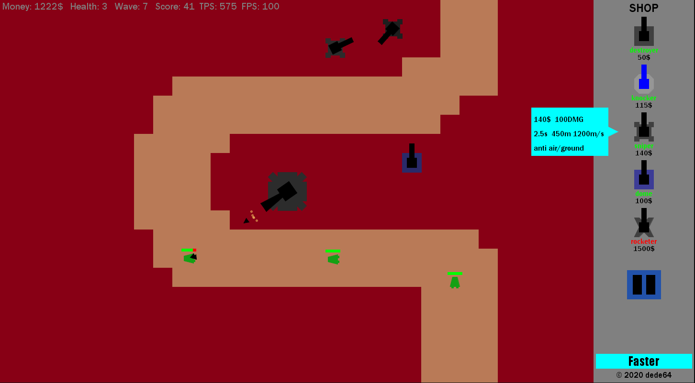
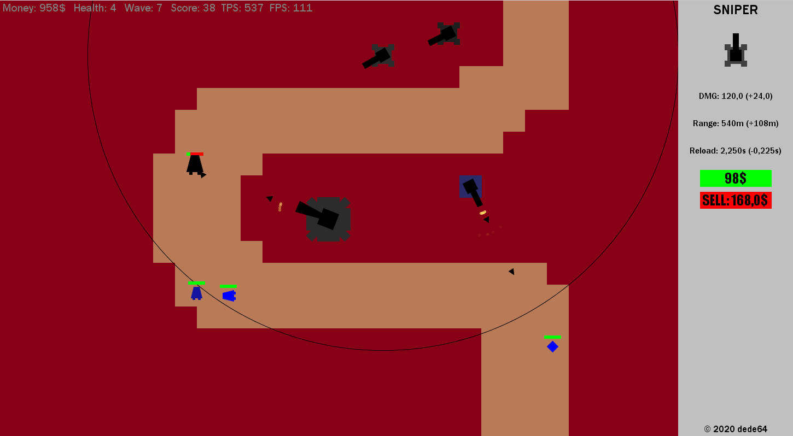
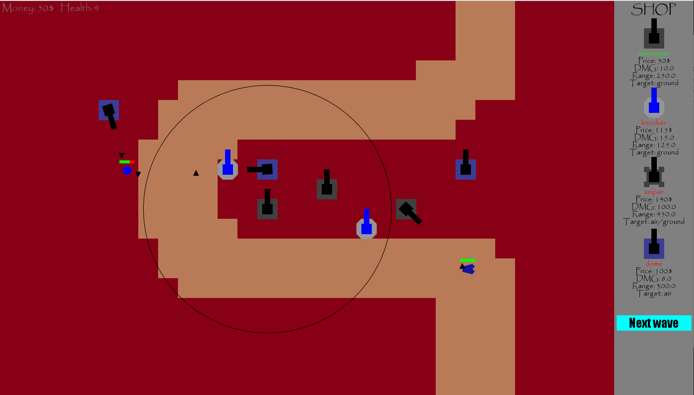

# tower_deffence
Final project of CS-Bridge 2018 - working prototype of the game was made in 2 days :]

If you want to just try the game, you can just run the exported.jar file.

Game is using Stanford acm library for displaying graphics. 

Library can be downloaded here: https://cs.stanford.edu/people/eroberts/jtf/javadoc/student/

### Example images
Screenshots from the game:

Tower upgrade menu:

Screenshot from the first game prototype made on CS-Bridge:

